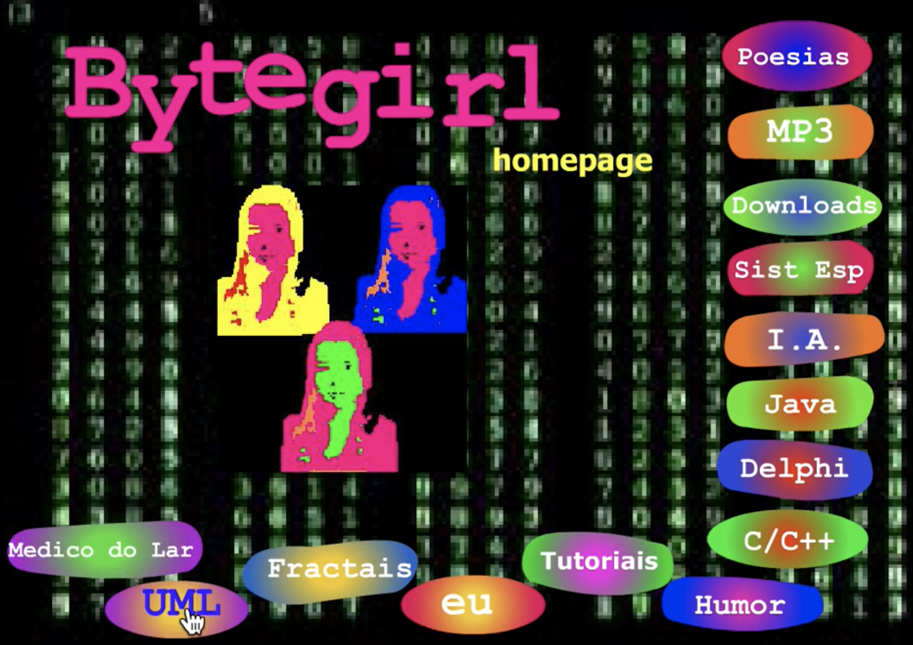
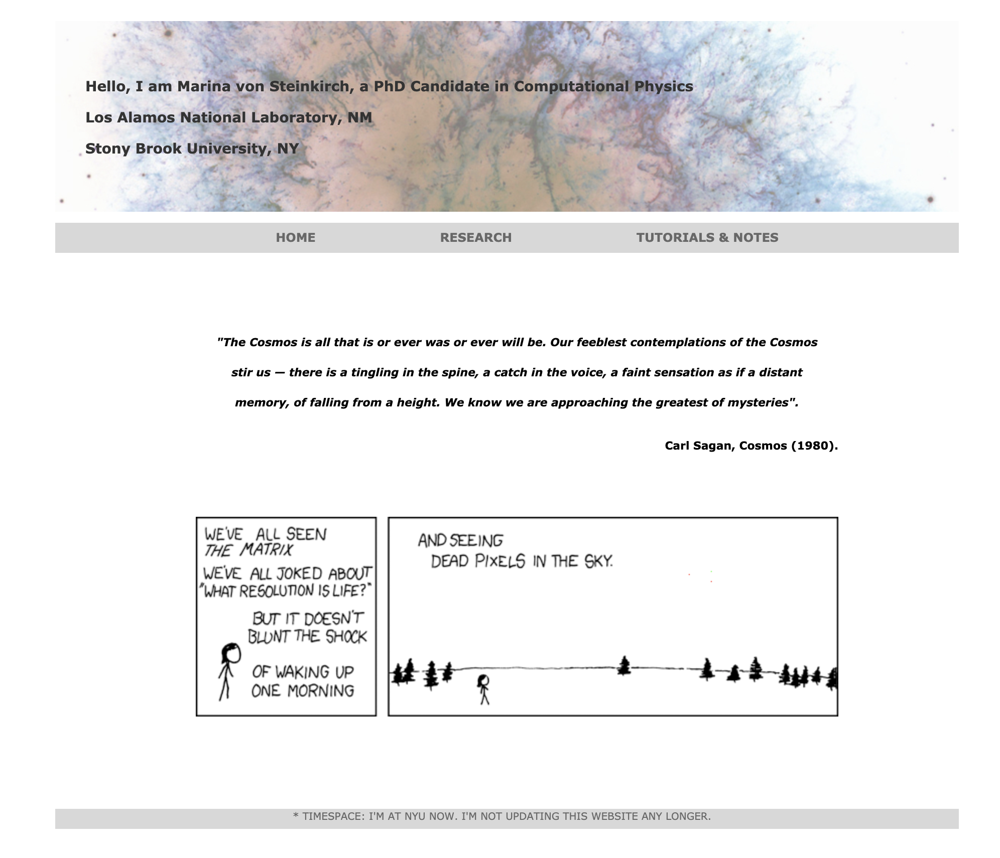

# Hello!


```

I am M. von Steinkirch, a theoretical physicist and a computer scientist.

I work on quantum computing, machine learning, and cloud infrastructure & orchestration. 

Previously, I was a senior software engineer at Apple, Yelp, Etsy, and Surfline; an undergrad
researcher at NASA Goddard Space; and a graduate researcher at Los Alamos National Laboratory 
and Brookhaven National Laboratory.

Below is my bio as a human who humbly loves to learn about our Universe and our beautiful planet.

"This is the real secret of life — to be completely engaged with what you are doing in the 
here and now. And instead of calling it work, realize it is play." - Alan Watts

```


---------


# Life as a Kid in South America


### 🖤 In the Beginning... Was the Command Line

I started playing with [computer terminals](https://en.wikipedia.org/wiki/MS-DOS) when I was a kid, in my Uncle's [386](https://en.wikipedia.org/wiki/Intel_80386). **Science, Hacking, and the Mysteries of the Universe** have been a favorite subject of mine since then. 


### 🖤 Science & Computers

I started being very interested in coding & how computers work by that time, so I wrote **my first website**, [http://fly.to/bytegirl](https://web.archive.org/web/20070808185215/http://fly.to/bytegirl):


<p align="center">

</p>


[It was made in Macromedia Flash](https://www.youtube.com/embed/gJ6t8Ogstfc), and it's
funny how some of my interests are still the same, such as AI and expert systems. Well, but not MP3 :).


---------

# Life as a Physicist, from Sao Paulo to New York  


### 🖤 School
  
I went for my **Ph.D. & M.Sc. degrees** in [Theoretical Physics](http://www.astro.sunysb.edu/steinkirch/index.html) at [Stony Brook University, New York](https://www.stonybrook.edu/) (with full-tuition scholarship), and for a **B.Sc. in Engineering & Physics** at the [University of Sao Paulo](https://en.wikipedia.org/wiki/University_of_S%C3%A3o_Paulo).

During college, I was an **undergraduate researcher** at the [Brazilian National Council for Scientific and Technological](http://www.cnpq.br/), where I studied **Cosmology** (more specifically, the equations of dark matter and dark energy), under the supervision of [Prof. Elcio Abdalla](http://fma.if.usp.br/~eabdalla/).


### 🖤National Laboratories

In the last year of college, I had the chance to spend a summer at [NASA's Goddard Space Flight Center](https://www.nasa.gov/goddard), as an **undergraduate researcher**, where I studied the **Physics of Active Galactic Nuclei**, with [Prof. Steve Kraemer](https://physics.catholic.edu/faculty-and-research/faculty-profiles/kraemer-steve/index.html).

As a **Ph.D. student**, I had a scholarship as a **graduate researcher** at the [Los Alamos National Laboratory](https://www.lanl.gov/) and the [Institute for Advanced Computational Science](https://iacs.stonybrook.edu/), where I developed **Monte Carlo simulations and data analysis to find the Physics of Neutron Stars**, with [Prof. Christopher Lee Fryer](https://www.lanl.gov/expertise/profiles/view/Christopher-Fryer), [Prof. Alan Calder](http://www.astro.sunysb.edu/acalder/), and [Prof. James M. Lattimer](http://www.astro.sunysb.edu/lattimer/).

I also had a chance to work for a year at the [Brookhaven National Laboratory](https://www.bnl.gov/world/), where I researched the **Physics of Quark-Gluon Plasmas** in the [Relativistic Heavy Ion Collider (RHIC)](https://www.bnl.gov/rhic/), with [Prof. Barbara Jacak](https://en.wikipedia.org/wiki/Barbara_Jacak).

During that time, I had the **honor of being awarded scholarships** to attend events such as [American Astronomical Society](https://aas.org/meetings/aas221), [HPC Xsede Summer School '13](https://www.xsede.org/web/summerschool13), [CERN Winter School '09](https://indico.cern.ch/event/37753), and the well-regarded *NYC programmer retreat* [Recurse Center'14 (formerly Hacker School)](https://www.recurse.com/).

### 🖤 Long nights at my student office

I open-sourced a [book on Group Theory](http://www.astro.sunysb.edu/steinkirch/books/group.pdf), which seems to be popular among graduate students at CALTECH (at least, that's what [Prof. Maria Spiropulu](http://pma.divisions.caltech.edu/people/maria-spiropulu) told me) and [other universities](https://gist.github.com/bt3gl/46062ac0867fac5d7027d55eddae7632).

I have [some scientific articles published](https://scholar.google.com/citations?user=2u83QMkAAAAJ&hl=en) in [Nuclear](https://journals.aps.org/prc/abstract/10.1103/PhysRevC.86.024908), [Astrophysics](http://iopscience.iop.org/article/10.3847/0004-637X/832/2/102), and [Cosmology](http://cds.cern.ch/record/1249755/files/p533.pdf). I have some whitepapers, tutorials, and open-source projects on [Quantum Computing](http://www.astro.sunysb.edu/steinkirch/books/qi.pdf), [Quantum Topological Field Theory](http://www.astro.sunysb.edu/steinkirch/#notes), [Machine Learning](https://github.com/bt3gl/NetAna-Complex_Network_Analysis), among others. You can check them out on my [graduate website](http://www.astro.sunysb.edu/steinkirch/index.html).


<p align="center">

</p>


------

# Life as a Software Engineer in California 

### 🖤 Hacking the planet

I returned to computer science due to the influence of the [hacking](https://en.wikipedia.org/wiki/Chaos_Computer_Club) [community](https://hope.net/first/). I presented a talk on [hacking quantum cryptography](https://github.com/bt3gl/talks_and_outreach/blob/master/2015/Hacking%20Quantum%20Cryptography.pdf) at [DEF CON's cryptovillage](https://www.defcon.org/) once.

When I was still in my Ph.D., I played several [CTF competitions](https://en.wikipedia.org/wiki/Wargame_(hacking)). I played for [Joel Eriksson](https://twitter.com/owarida?lang=en)'s team, [HackingForSoju (23th in 2014)](https://hackingforsoju.team/), and with a Polish team named [Snatch The Root (29th in 2014)](https://ctftime.org/team/7016).

At that time, I open-sourced a [book on Python and Algorithms](https://github.com/bt3gl/Python-and-Algorithms-and-Data-Structures). In 2015, [Hanbit Media, Inc.](http://www.hanbit.co.kr/) bought my book so that they would have it translated to Korean 💁🏻‍♀️. I maintain a [repository for penetration testing that has 1k+ stars](https://github.com/bt3gl/Pentesting-Toolkit). I open-sourced a [tool to make GCP security easier](https://github.com/bt3gl/Amigo-Google_Cloud_Platform_Security).

### 🖤 Working at Yelp

My first job outside the academy was as a **security software engineer** at [Yelp](https://engineeringblog.yelp.com/). There I created an in-house **machine learning software for DNS/Web endpoint data analysis**. I also worked on several infrastructure and security tasks.

### 🖤 Working at Apple

I was a **senior software engineer** at the Core OS (security) team at [Apple](https://www.apple.com/business/docs/site/iOS_Security_Guide.pdf) for a year, under [Ivan Krstić](https://twitter.com/radian?lang=en)'s supervision, where I developed software to help with **Apple's internal security and incident response**, I researched iOS Security hardening, and I helped writing Apple's Deep Learning toolkit for richer data augmentation for image recognition.

### 🖤 Working at Etsy

I was a **senior infrastructure software engineer** at [Etsy](https://codeascraft.com/) for a year and a half, at [Will Rogers](https://www.linkedin.com/in/will-rogers-b662b6a9)'s and [Ben Hughes](https://www.linkedin.com/in/beayeah)'s team. There, I developed an **incident response infrastructure for Etsy's fleet, with OSQuery**. I wrote a [security suite for GCP](https://github.com/bt3gl/Amigo-Google_Cloud_Platform_Security), that identifies and alerts on security flaws and misconfigurations.

### 🖤 Startups

I spent a summer hanging out with the folks from [Surfline](https://surfline.com), where I helped build an [end-to-end pipeline & software for surfers to retrieve clips of the waves they caught](https://www.surfline.com/lp/sessions) (from over 500+ cameras worldwide), and I learned how they maintain a worldwide camera infrastructure.

I spent a winter helping out the folks at the [Quantum Gravity Research Institute](https://quantumgravityresearch.org/), working together with [Klee Irwin](https://www.kleeirwin.com/) and his team to **simulate a quantum gravitational theory on quasicrystals**. I also taught Agile and DevOps practices for a team of 10+ scientists.


---


# Life is This Very Moment

These are my lifelong interests:


### 🖤 Cloud infrastructure & orchestration

- Sometimes I write [articles on software, cloud infrastructure, and orchestration](https://medium.com/python-for-the-utopian). 
- I maintain a [curated repository on cloud infrastructure resources](https://github.com/bt3gl/Curated_Cloud_and_Orchestration) and a [curated repository on Kafka and streaming processing](https://github.com/bt3gl/Curated_Kafka_and_Streaming_Processing).
- [Here is an open-sourced repository for an end-to-end pipeline in AWS](https://github.com/bt3gl/AWS-Pipeline-Videos-with-FFMPEG) to retrieve and edit clips (using lambda functions in Python, and AWS resources such as SQS and SNS).


### 🖤 Quantum computing

- I work with the folks from [Unitary Fund](http://unitary.fund/) to develop **software technology for quantum computing**. Check out our [NISQ Algorithm Zoo](https://nisqalgorithmzoo.com/). 
- Whenever I can, I try to contribute to [Google's Cirq](https://github.com/quantumlib/Cirq/pulls?q=is%3Apr+author%3Abt3gl+is%3Aclosed) (a framework for creating, editing, and invoking NISQ circuits).
- [Curiee](http://curiee.com/) is a non-profit **language-agnostic destination** for software engineers and hackers to learn, play, and publish **quantum computing code**. We have lots of ideas for the future to come 🙃.
- Sometimes I write [articles on quantum computing](https://medium.com/quantum-computing-for-the-utopian).
- I maintain a [curated repository on quantum computing resources](https://github.com/bt3gl/Curated_Quantum_Computing).
- Almost a decade ago, I wrote a lil [e-book in Quantum Information](http://www.astro.sunysb.edu/steinkirch/books/qi.pdf).

### 🖤 Machine learning & virtual reality

- I maintain a curated repository on [ETL, Machine Learning, and pipelines](https://github.com/bt3gl/Curated_ETL-and-ML-Pipelines).
- Here are some of my open-sourced ML projects from my Ph.D. projects: [projects website](http://miasoldwebsite.s3-website-us-east-1.amazonaws.com/), [NetAna](https://github.com/bt3gl/NetAna-Complex_Network_Analysis), [NetClean](https://github.com/bt3gl/NetClean-Complex_Networks_Data_Cleanser), [MFITS](https://github.com/bt3gl/MFits-Astrophysical_Analyzer), [MLNet](https://github.com/bt3gl/MLNet-Machine_Learning_to_Classify_Complex_Networks), and [Stony Brook graduate class](https://github.com/bt3gl/Machine_Learning_Stony_Brook_Grad_Course). 
- Back in the day, I wrote a paper [On Classifying Complex Networks by their Topological Features](http://miasoldwebsite.s3-website-us-east-1.amazonaws.com/docs/ml_report.pdf), and [on hacking XBOX Kinetic's cameras](https://github.com/bt3gl/Hacking_XBOX_Kinetic).
- Welcome to the brave new world of [dream3rs](http://dream3rs.com/) 👾.


### 🖤 Counterculture, entrepreneurism, extreme sports, the nomadic life, the meaning of life, the death of the self

- Some time ago **I took a sabbatical year to travel, learn transcendental meditation, and become better at my three favorite sports**: [snowboarding](https://gist.github.com/bt3gl/b25aaa15a6fb123f0865644a470004cc), [skateboarding](https://gist.github.com/bt3gl/8b98e7c00f3ede7d3205120cacdc4994), and [surfing](https://gist.github.com/bt3gl/b7ab2b4d35bd9d673bf31c82e8f117a3). I did [a lot of droning at that time](https://vimeo.com/mvonsteinkirch) and [I made some art](https://www.pexels.com/@mia-von-steinkirch-2063733).
- Having been a nomad since I left home when I was 16, these are **the places I lived in for at least a few months**: New York City, San Francisco, Los Angeles, Malibu, Oahu, Maui, San Diego, Washington DC, Long Island, Santiago, and Sao Paulo. Every city is an entirely new world, but in the end, we are all humans living our human lives.
- Check out [The Smart Investor](https://github.com/bt3gl/The_Smart_Investor), a software for financial portfolio management and analysis.
- I maintain a curated repository on [resources on becoming a digital nomad](https://github.com/bt3gl/Awesome-Nomad_Jobs) and a curated repository on [resources on entrepreneurism](https://github.com/bt3gl/Awesome_Entrepreneur).
- If you are into **statements in your tees**, please check my friends' [nihil.city](https://nihil.city/). It comes with [a pretentious medium pub](https://medium.com/nihil-city).
- My favorite motto is **Impossible is a state of mind**. From extreme sports, I like to think about this: **Once we control our emotional response to events, time will move much slower**.
- Here are some [quotes](https://gist.github.com/bt3gl/2425d9db10c3238476665bfaa256a470) and [artistic elements](https://gist.github.com/bt3gl/b084eba1862d8abdc4869d9527a8d35e) I regard. [Here](https://github.com/bt3gl/Public_Speaking) are some of the talks I have presented in the past.
- **Want to chat with me?** [Grab some time in my calendar](https://calendly.com/steinkirch/30min?month=2020-02) or send me a message through [Keybase](https://keybase.io/steinkirch). Topics of interest are everything you read in this gist + **ideas to make the World better** (disclaimer: I might take a week or more to get back to you, but I respond every message I get. Ah, and I am not looking for any job at the moment).


